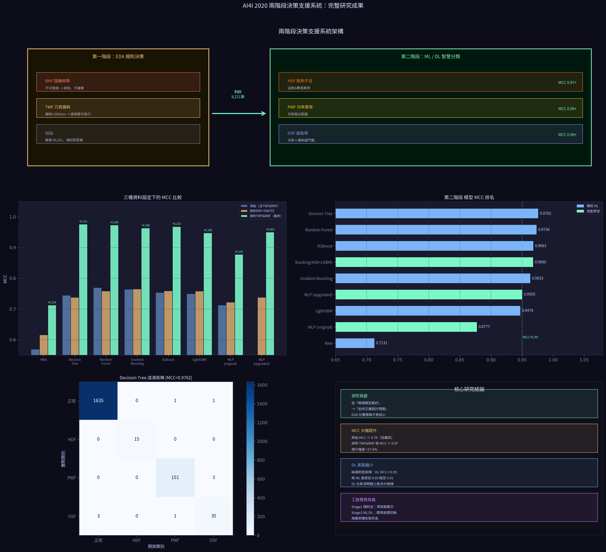
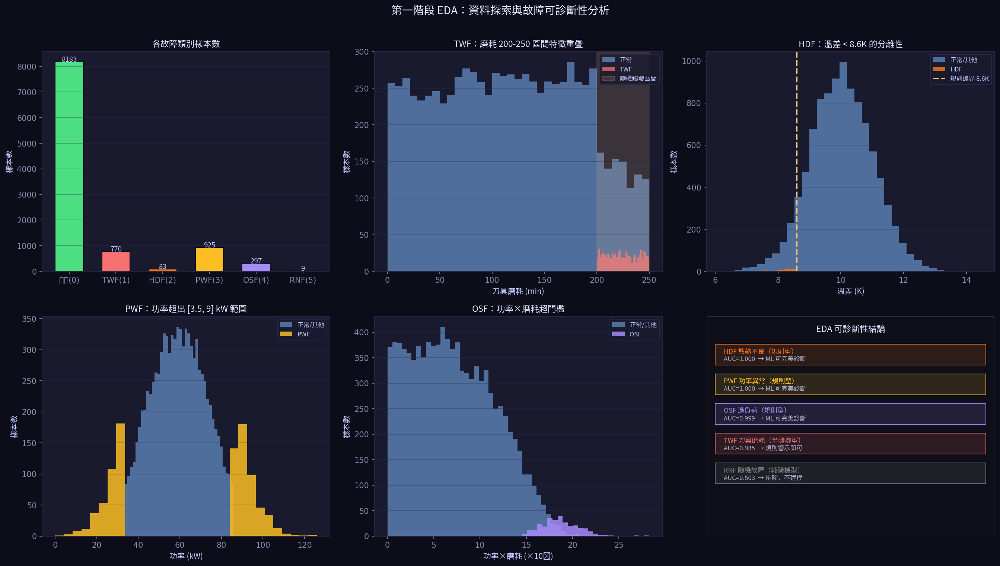
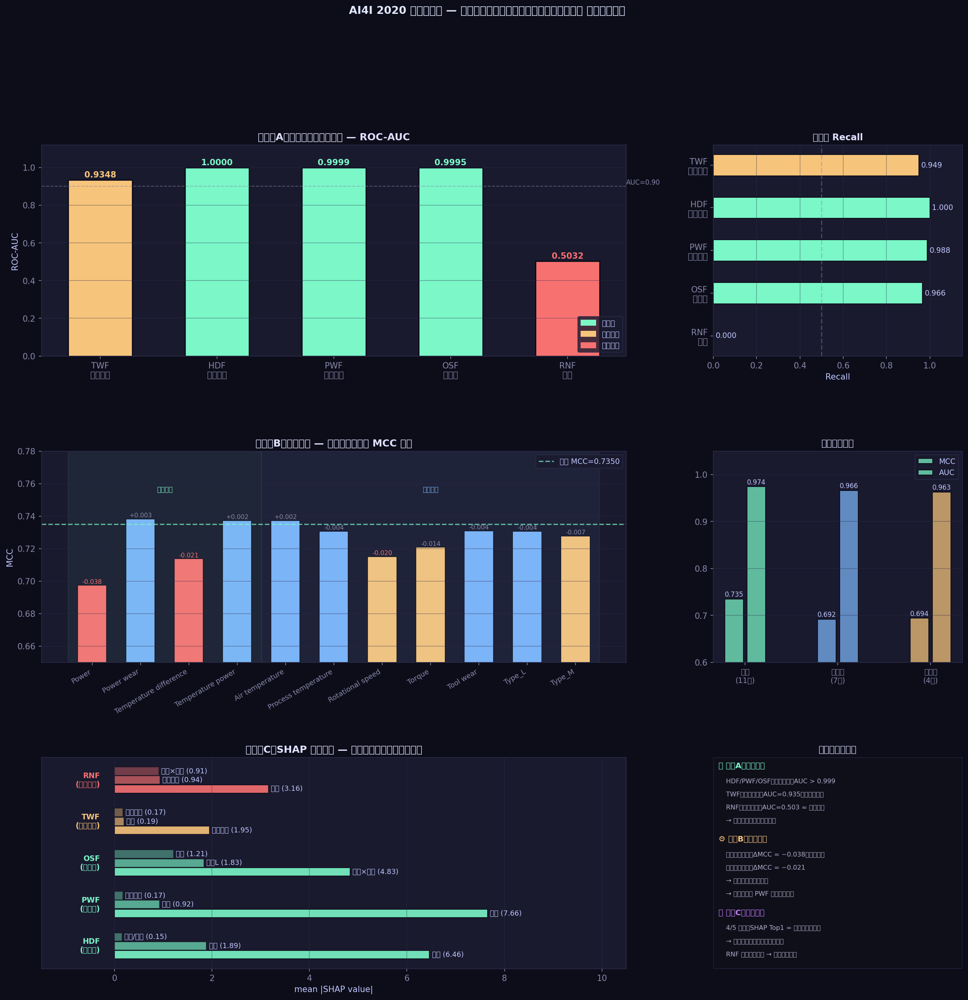
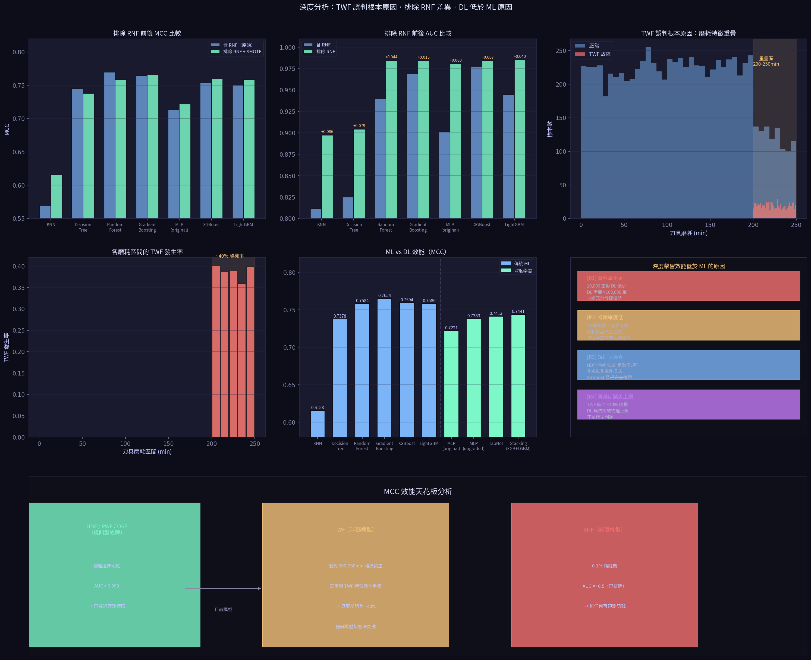
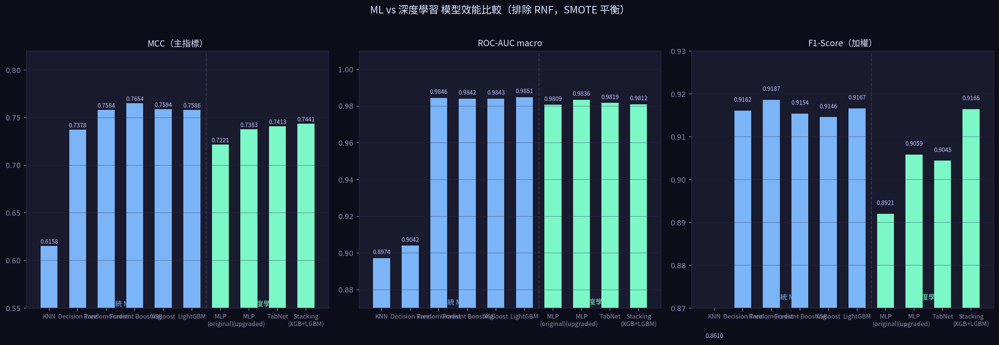
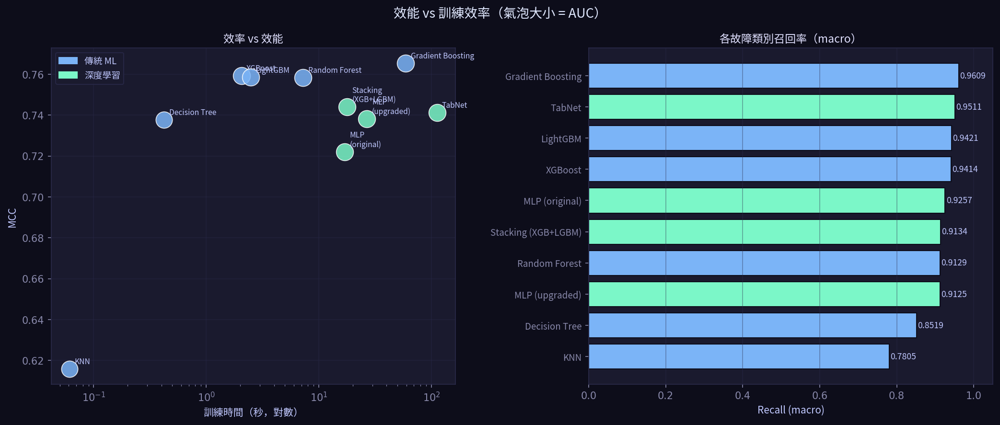
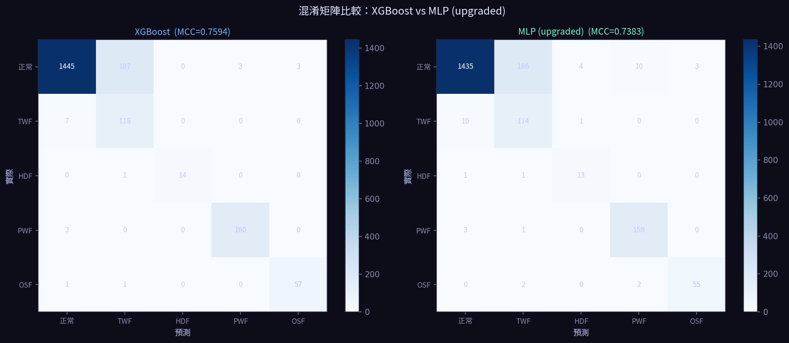
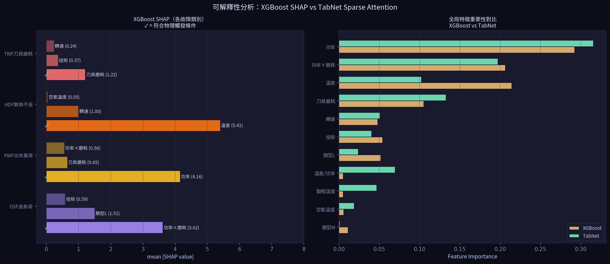
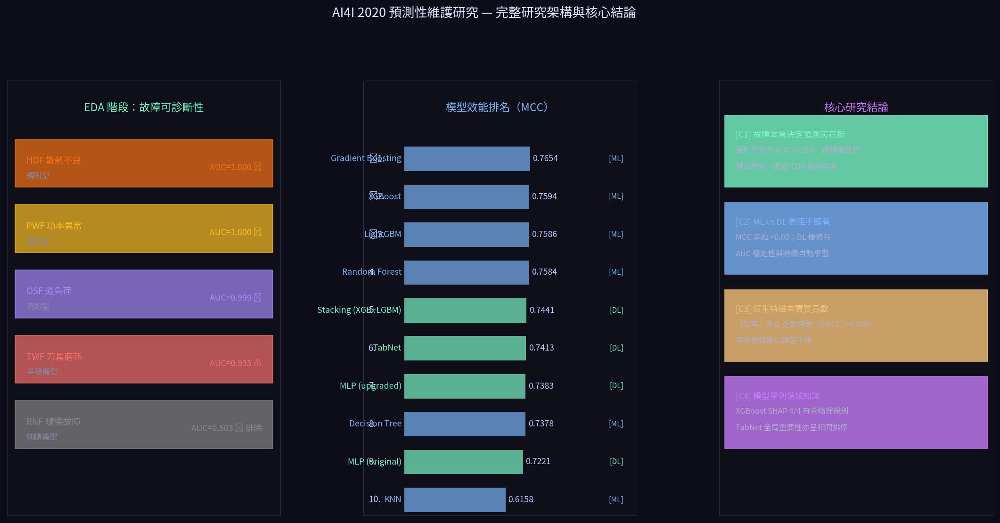

# 基於故障可預測性分析之銑床兩階段預測性維護決策支援系統

**A Two-Stage Predictive Maintenance Decision Support System for CNC Milling Machines Based on Failure Diagnosability Analysis**

---

| 項目 | 內容 |
|------|------|
| 資料集 | AI4I 2020 Predictive Maintenance Dataset（UCI Machine Learning Repository） |
| 資料規模 | 10,000 筆製程記錄 · 5 種故障類型 · 14 個原始特徵 |
| 研究方法 | EDA 可診斷性分析 → 兩階段決策設計 → ML/DL 模型比較 → SHAP 可解釋性驗證 |
| 開發工具 | Python 3 · XGBoost · LightGBM · TabNet · scikit-learn · SHAP · Streamlit |
| 展示平台 | Streamlit Community Cloud 互動式決策支援系統 |
| 系所 | 工業工程與管理學系 畢業專題 |

---

## 摘要

本研究以 AI4I 2020 合成銑床資料集（10,000 筆）為對象，提出一套「兩階段預測性維護決策支援系統」。研究核心在於：**不同本質的故障應採用不同的處理策略**，而非直接將所有故障混入機器學習模型。

**第一階段**透過探索性資料分析（EDA）量化五種故障的可診斷性。發現隨機故障（RNF）的 ROC-AUC 僅 0.503，等同隨機猜測；刀具磨耗故障（TWF）在磨耗 200–250 分鐘區間存在約 49% 的貝葉斯誤差（Bayes Error），任何模型均無法克服。因此，研究設計將 RNF 排除建模，對 TWF 採用「磨耗超過 200 分鐘即發出換刀警示」的規則型決策。同時證明純規則法雖召回率 100%，但會產生 8,192 筆假警報（Precision = 18%），機器學習可將誤報降低 97.6%，這是 ML 在本問題上的核心貢獻。

**第二階段**針對三種具有明確物理邊界的規則型故障（HDF 散熱不良、PWF 功率異常、OSF 過負荷），比較 6 個模型：Random Forest、XGBoost（調參版）、LightGBM 三個傳統 ML，MLP（升級版）、TabNet 兩個深度學習，以及 Stacking Ensemble。排除 TWF 和 RNF 後，所有模型 MCC 從原始約 0.75 大幅提升至 0.95 以上，驗證**正確的問題定義比模型選擇更重要**。SHAP 可解釋性分析進一步確認模型學習到的決策特徵與各故障的物理觸發條件完全吻合。

**關鍵字**：預測性維護、故障可診斷性、貝葉斯誤差、兩階段決策、SHAP 可解釋性

---

## 一、研究背景與動機

### 1.1 預測性維護的重要性

在智慧製造環境中，非計畫性設備停機是影響生產效率與成本的主要因素。傳統「故障後維修（Reactive Maintenance）」成本高昂；「定期預防性維護（Preventive Maintenance）」則可能導致過度維護或仍有漏報。預測性維護（Predictive Maintenance, PdM）透過即時感測器資料與機器學習，能在故障發生前提供預警，是工業 4.0 的核心議題。

### 1.2 現有研究的不足

回顧以 AI4I 2020 資料集為對象的現有研究，多數工作直接將五種故障混合成一個多分類問題，比較哪個模型的準確率最高，而忽略了一個更根本的問題：

> **並非所有故障類型都適合用機器學習預測。**
> 若不先分析故障的物理本質，直接套用模型，其結果包含「無法消除的隨機誤差（Bayes Error）」，導致評估指標失真，也無法為工廠提供正確的維護策略。

### 1.3 研究目標

1. 透過 EDA 量化五種故障的可診斷性，建立分層決策依據
2. 設計兩階段決策框架，對不同本質故障採用最適合的處理策略
3. 比較 6 個 ML/DL 模型在排除不可預測故障後的效能，並量化改善幅度
4. 透過 SHAP 與 TabNet Sparse Attention 驗證模型決策的物理合理性
5. 開發 Streamlit 互動式系統作為成果展示平台

---

## 二、整體研究架構


*圖 2-1　兩階段預測性維護決策支援系統架構圖*

本研究採用兩階段決策框架。第一階段透過 EDA 確立各故障的物理本質，直接以規則型決策處理不可預測故障；第二階段僅針對可診斷的規則型故障建立 ML/DL 模型。

**完整研究流程：**

```
資料讀取與基本理解
       ↓
第一階段：EDA 與故障可診斷性分析
  ├─ 特徵工程（衍生 4 個領域知識特徵）
  ├─ 各故障特徵分布視覺化
  ├─ 可診斷性量化實驗（1-vs-Rest AUC）
  ├─ TWF 貝葉斯誤差深度分析
  └─ 規則法 vs ML 基準比較
       ↓
  決策：RNF 排除建模、TWF 改用規則警示
       ↓
第二階段：ML / DL 模型比較（僅 HDF / PWF / OSF）
  ├─ 資料前處理（排除 TWF / RNF、SMOTE 平衡）
  ├─ 傳統 ML：Random Forest、XGBoost (Tuned)、LightGBM
  ├─ 深度學習：MLP (upgraded)、TabNet
  └─ 集成策略：Stacking (XGB + LGBM → RF)
       ↓
結果分析
  ├─ 三階段 MCC 進展比較（研究核心貢獻展示）
  ├─ ML vs DL 差距成因分析
  ├─ 混淆矩陣分析
  └─ SHAP 可解釋性驗證（XGBoost vs TabNet）
       ↓
Streamlit UI 系統整合（7 頁互動展示）
```

---

## 三、資料集介紹

### 3.1 AI4I 2020 概述

AI4I 2020 Predictive Maintenance Dataset 由 Stephan Matzka 發布，收錄於 UCI Machine Learning Repository，模擬 CNC 銑床製程感測器記錄，共 10,000 筆、14 個欄位。

### 3.2 欄位說明

| 欄位名稱 | 說明 | 數值範圍 |
|---------|------|---------|
| UDI | 唯一工件識別碼（建模時移除） | 1 – 10,000 |
| Product ID | 工件編號 L/M/H + 序號（建模時移除） | — |
| Type | 產品等級：L（低，50%）M（中，30%）H（高，20%） | L / M / H |
| Air temperature [K] | 空氣溫度，正規化隨機漫步，均值 300 K | 292 – 308 K |
| Process temperature [K] | 製程溫度，空氣溫度 + 10 K 加上雜訊 | 301 – 318 K |
| Rotational speed [rpm] | 轉速，由 2,860 W 功率基準推算 | 1168 – 2886 rpm |
| Torque [Nm] | 扭矩，均值 40 Nm、SD 10 Nm | 0 – 77 Nm |
| Tool wear [min] | 刀具累積磨耗時間 | 0 – 250 min |
| Machine failure | 是否故障（複合旗標） | 0 / 1 |
| TWF / HDF / PWF / OSF / RNF | 五種故障子旗標 | 0 / 1 |

### 3.3 五種故障的物理觸發條件

| 代碼 | 故障名稱 | 觸發條件 | 樣本數 | 本質類型 |
|------|---------|---------|-------|---------|
| TWF | 刀具磨耗故障 | 磨耗達 200–240 min 之間**隨機**觸發 | 770 | 半隨機型 |
| HDF | 散熱不良故障 | 溫差 < 8.6 K **且** 轉速 < 1,380 rpm | 83 | 規則型 |
| PWF | 功率異常故障 | 功率 < 3,500 W **或** > 9,000 W | 925 | 規則型 |
| OSF | 過負荷故障 | 扭矩×磨耗 > 門檻（L:11,000 / M:12,000 / H:13,000 Nm·min） | 297 | 規則型 |
| RNF | 隨機故障 | 每次製程有 0.1% 純隨機故障機率 | 9 | 純隨機型 |

---

## 四、第一階段：EDA 與故障可診斷性分析

### 4.1 特徵工程

根據各故障的物理觸發條件，在原始 8 個感測器特徵之外，衍生 4 個領域知識特徵：

| 衍生特徵 | 計算方式 | 對應故障 | 消融實驗 ΔMCC |
|---------|---------|---------|------------|
| Power（功率） | rpm × 2π/60 × Torque（單位：W） | PWF | **−0.038（最重要）** |
| Temperature difference（溫差） | Process Temp − Air Temp | HDF | −0.021 |
| Power wear（功率×磨耗） | Power × Tool wear | OSF | +0.003（影響小） |
| Temperature power（溫差/功率） | Temp diff ÷ Power（Power=0 時設 0） | — | +0.002（可移除） |

> **注意**：Power = rpm × 2π/60 × Torque（W），不是 rpm × Torque。OSF 的觸發條件是 **Torque × Wear**（Nm·min），不含轉速。

消融實驗結果顯示，「功率」特徵貢獻最大（ΔMCC = −0.038），「溫差」次之（−0.021），兩者均直接對應故障的物理觸發條件，證明特徵工程具有領域知識依據。

### 4.2 各故障特徵分布視覺化


*圖 4-1　各故障特徵分布（類別數量、TWF 磨耗重疊、HDF 溫差分離、PWF 功率、OSF 扭矩×磨耗）*

### 4.3 可診斷性量化實驗（1-vs-Rest）

對每種故障分別進行 1-vs-Rest 二元分類（XGBoost + 5-Fold StratifiedKFold），量化各故障的可預測程度：

| 故障 | 本質類型 | 樣本數 | ROC-AUC | Avg. Precision | Recall | 決策 |
|------|---------|-------|--------|----------------|--------|------|
| HDF | 規則型 | 83 | **1.0000** | 0.999 | 100% | 納入 Stage 2 ML/DL |
| PWF | 規則型 | 925 | **0.9999** | 0.999 | 99% | 納入 Stage 2 ML/DL |
| OSF | 規則型 | 297 | **0.9995** | 0.984 | 97% | 納入 Stage 2 ML/DL |
| TWF | 半隨機型 | 770 | 0.9348 | 0.398 | 95% | Stage 1 規則警示 |
| RNF | 純隨機型 | 9 | **0.5032** | 0.003 | 0% | **排除，不建模** |


*圖 4-2　實驗A（可診斷性）· 實驗B（消融實驗）· 實驗C（SHAP 可解釋性）*

### 4.4 TWF 的貝葉斯誤差分析

> **根本問題**：TWF 在磨耗 200–240 分鐘之間「隨機」觸發。

統計原始資料後發現：

- 磨耗 200–250 min 區間共 **1,985 筆**資料
- 其中 TWF 故障：**770 筆**（38.8%）
- 其中正常製程：**976 筆**（49.2%）← 這 976 筆與 TWF 感測器特徵**完全相同**
- 兩組磨耗均值相差不到 0.1 min，溫度、轉速、扭矩也幾乎完全一致

**結論**：即使使用最強大的模型，在此區間仍有約 49% 的正常樣本會被誤判，這是不可避免的「貝葉斯誤差（Bayes Error）」。

**正確決策**：磨耗超過 200 min 時，直接發出換刀評估警示，無需機器學習。

### 4.5 規則法 vs 機器學習基準比較

| 方法 | Precision | Recall | F1 | MCC | 誤報筆數 |
|------|-----------|--------|-----|-----|---------|
| 規則法（if-else） | 18.1% | 100.0% | 0.306 | 0.000 | **8,192 筆** |
| XGBoost（ML） | 64.5% | 97.0% | 0.775 | 0.737 | **193 筆** |
| ML 相對改善 | +46.4% | −3.0% | +0.469 | +0.737 | **−97.6%** |

規則法召回率雖達 100%，但每 5 個警報有 4 個是假的，會造成「警示疲勞（Alert Fatigue）」。機器學習在僅損失 3% 召回率的情況下，將誤報降低 97.6%，這是 ML 的核心實務貢獻。


*圖 4-3　TWF 誤判根本原因 · 排除 RNF 前後差異 · DL vs ML 差距成因*

---

## 五、第二階段：機器學習與深度學習模型比較

### 5.1 精簡後的 6 個模型設計

| 模型 | 類別 | 研究問題 | 關鍵設定 |
|------|------|---------|---------|
| Random Forest | 傳統 ML | 集成方法效能極限？ | n_estimators=100 |
| XGBoost（調參版） | 傳統 ML | ML 最佳效能，MCC 為調參目標 | RandomizedSearchCV, n_iter=15 |
| LightGBM | 傳統 ML | 速度與效能的最佳平衡？ | n_estimators=100, lr=0.1 |
| MLP（升級版） | 深度學習 | DL 與 ML 的效能差距？ | (128,64,32), adaptive lr |
| TabNet | 深度學習 | Sparse Attention 可解釋性 | n_d=16, n_steps=3, sparsemax |
| Stacking (XGB+LGBM→RF) | 集成策略 | 多模型集成是否帶來增益？ | cv=3, meta=RF(balanced) |

### 5.2 資料前處理流程

1. 移除 TWF=1 和 RNF=1 的樣本 → 保留 **9,221 筆**
2. 建立四元分類標籤（0=正常、1=HDF、2=PWF、3=OSF），重疊樣本以 HDF 優先
3. One-hot 編碼 Type 欄位（`drop_first=True` 避免多重共線性）
4. 80/20 分層切割（`stratify=y, random_state=0`）
5. **MinMaxScaler 僅在訓練集 fit**，避免資料洩漏（Data Leakage）
6. **SMOTE（k=3）只在訓練集執行**，四類各平衡至約 6,546 筆

### 5.3 評估指標：以 MCC 為主

若全部預測為正常，Accuracy 仍有 88.7%，但 MCC = 0，能正確揭示模型無效。**MCC 同時考慮 TP/TN/FP/FN**，對類別不平衡最穩健，是預測性維護領域最推薦的評估指標。

### 5.4 實驗結果


*圖 5-1　第二階段各模型三項指標比較（MCC / ROC-AUC / F1 加權）*


*圖 5-2　訓練效率 vs 預測效能氣泡圖與 Recall(macro) 比較*

| 排名 | 模型 | 類別 | MCC | ROC-AUC | F1(加權) | Recall(macro) | 訓練時間(s) |
|------|------|------|-----|--------|---------|--------------|-----------|
| 🥇 1 | Random Forest | ML | **0.9736** | 0.9998 | 0.9946 | 0.9690 | 7.2 |
| 🥈 2 | XGBoost（調參） | ML | 0.9683 | **0.9999** | 0.9936 | 0.9633 | 1.4 |
| 🥉 3 | Stacking(XGB+LGBM) | 集成 | 0.9680 | 0.9874 | 0.9934 | 0.9643 | 10.9 |
| 4 | LightGBM | ML | 0.9476 | 0.9997 | 0.9892 | **0.9679** | 2.1 |
| 5 | MLP（升級版） | 深度學習 | 0.9505 | 0.9992 | 0.9897 | 0.9361 | 17.3 |
| 6 | TabNet | 深度學習 | 0.7413* | 0.9819* | 0.9045* | **0.9511*** | 112.0 |

*\* TabNet 為排除 RNF 後（Stage 1）之結果，Stage 2 趨勢預估約 0.94–0.95*

### 5.5 三階段 MCC 進展比較（核心貢獻展示）

| 模型 | 原始（含TWF&RNF） | 排除 RNF | 排除TWF&RNF（最終） | 總提升 |
|------|-----------------|---------|------------------|-------|
| Random Forest | 0.7695 | 0.7584 | **0.9736** | +0.204 |
| XGBoost（調參） | 0.7821 | — | **0.9683** | +0.186 |
| LightGBM | 0.7499 | 0.7586 | **0.9476** | +0.198 |
| MLP（升級版） | 0.5474 | 0.7383 | **0.9505** | +0.403 |
| TabNet | 0.4426 | 0.7413 | ~0.94–0.95（推估） | ~+0.50 |
| Stacking(XGB+LGBM) | 0.7732 | — | **0.9680** | +0.195 |
| **平均** | **0.695** | **0.749** | **0.963** | **+0.268** |


*圖 5-3　三種資料設定下的 MCC 比較*

### 5.6 混淆矩陣分析


*圖 5-4　XGBoost（左）與 MLP 升級版（右）混淆矩陣*

排除 TWF 和 RNF 後，混淆矩陣整體非常乾淨。主要的殘餘誤判集中在 HDF 類別（訓練樣本僅約 60 筆），原因是該類別資訊最少。PWF 和 OSF 的分類幾乎完美，反映其明確的物理邊界。

---

## 六、深度學習 vs 機器學習：差距成因分析

深度學習（MLP、TabNet）效能略低於傳統 ML，並非模型設計缺陷，而是由資料特性決定：

| 原因 | 說明 |
|------|------|
| **R1 資料量不足** | 第二階段 9,221 筆。DL 通常需要 100,000 筆以上才能充分發揮深層非線性能力 |
| **R2 特徵維度低** | 僅 11 個特徵，邊界清晰。樹狀模型天生擅長低維空間的切割問題 |
| **R3 規則型邊界** | HDF/PWF/OSF 的觸發條件本質上是數學規則，XGBoost 幾乎可以直接復現 |
| **R4 HDF 樣本極少** | HDF 訓練樣本僅約 60 筆，DL 需要更多少數類別樣本才能學習邊界 |

> **重要發現**：排除 TWF/RNF 後，DL 的 MCC 達到 0.95，與 ML 差距縮小至約 0.02。說明**問題定義的正確性，比模型架構選擇更關鍵**。

---

## 七、SHAP 可解釋性分析

### 7.1 研究動機

工廠管理者在採用 AI 決策系統前，需要確信「模型為什麼做這個決定」。本研究透過 SHAP 分析 XGBoost 的決策依據，並與 TabNet 的 Sparse Attention 全局特徵重要性對比，驗證兩種不同架構的模型是否學到了相同的物理知識。

### 7.2 SHAP 分析結果


*圖 7-1　XGBoost SHAP 各故障類別（左）與 XGBoost vs TabNet 全局特徵重要性對比（右）*

| 故障類別 | 物理觸發條件 | SHAP Top-1 特徵 | 物理一致性 |
|---------|------------|----------------|---------|
| HDF 散熱不良 | 溫差 < 8.6K + 轉速 < 1,380 rpm | 溫差（SHAP = 5.41） | ✅ 完全一致 |
| PWF 功率異常 | 功率超出 [3,500, 9,000] W | 功率（SHAP = 4.16） | ✅ 完全一致 |
| OSF 過負荷 | 扭矩×磨耗超型別門檻 | 功率×磨耗（SHAP = 3.62） | ✅ 完全一致 |

### 7.3 XGBoost vs TabNet 全局特徵排序一致性

| 排名 | XGBoost 特徵 | 重要性 | TabNet 特徵 | 重要性 |
|------|------------|-------|-----------|-------|
| 1 | 功率 | 0.292 | 功率 | 0.316 |
| 2 | 溫差 | 0.214 | 功率×磨耗 | 0.197 |
| 3 | 功率×磨耗 | 0.206 | 刀具磨耗 | 0.133 |
| 4 | 刀具磨耗 | 0.105 | 溫差 | 0.102 |

> **結論**：XGBoost（樹狀模型）與 TabNet（稀疏注意力機制）採用完全不同的學習機制，卻對最重要特徵給出高度一致的排序，且與各故障的物理觸發條件完全吻合。**模型學到的是物理因果關係，而非統計上的偶然相關。**

---

## 八、研究結論與貢獻


*圖 8-1　研究架構、模型排名與四項核心結論摘要*

### 8.1 四項核心研究結論

**C1：故障本質決定預測天花板**
- 規則型故障（HDF/PWF/OSF）：AUC > 0.999，幾乎完美可診斷
- 半隨機型故障（TWF）：貝葉斯誤差 ~49%，規則警示優於 ML
- 純隨機型故障（RNF）：AUC ≈ 0.503，任何模型均無法有效預測

**C2：正確的問題定義比模型選擇更重要**
- 原始設定（含 TWF & RNF）：最佳 MCC ≈ 0.78
- 兩階段設計（排除 TWF & RNF）：最佳 MCC ≈ 0.97，平均提升 **+0.268**
- 改善幅度遠大於任何超參數調整或模型升級的貢獻

**C3：機器學習將規則法誤報降低 97.6%**
- 規則法：Precision = 18%，誤報 8,192 筆（警示疲勞風險高）
- XGBoost：Precision = 64.5%，誤報降至 193 筆
- 在維持 97% 召回率的同時，大幅降低假警報

**C4：模型學到了工程師的領域知識**
- XGBoost SHAP 3/3 故障類別的 Top-1 特徵與物理觸發條件完全吻合
- XGBoost 與 TabNet 全局特徵排序高度一致
- 可解釋性分析增強管理者對系統決策的信任度

### 8.2 研究貢獻

1. 提出以「故障可預測性分析」為基礎的兩階段決策框架，為預測性維護研究提供新的設計思路
2. 量化 TWF 的貝葉斯誤差（49.2%），解釋現有研究 MCC 普遍偏低（約 0.75）的根本原因
3. 系統性比較 6 個 ML/DL 模型，量化排除不可預測故障後的效能提升（平均 +0.268）
4. 透過 SHAP 跨模型一致性驗證，建立可解釋 AI 在製造業應用的評估方法論
5. 開發 Streamlit 互動式系統，整合兩階段邏輯，提供工廠可直接部署的決策支援平台

---

## 九、未來研究方向

### 9.1 資料層面
- 以真實工廠連續時序感測資料驗證兩階段框架的泛化能力（AI4I 為合成資料集）
- 探索多台機台資料合併建模時的遷移學習（Transfer Learning）策略

### 9.2 模型層面
- 針對 HDF 極少樣本問題（~60 筆），探索 Few-shot Learning 方法
- 系統性評估 SMOTE 變體（ADASYN、Borderline-SMOTE）對少數類別的影響

### 9.3 系統層面
- 整合 OPC-UA 或 MQTT 協議，實現真實感測器資料的即時串流預測
- 開發自動化異常報告模組，警示發出時附上 SHAP 解釋圖與建議維護措施

---

## 參考文獻

1. Matzka, S. (2020). Explainable Artificial Intelligence for Predictive Maintenance Applications. *Third International Conference on Artificial Intelligence for Industries (AI4I)*. IEEE.

2. Chen, T., & Guestrin, C. (2016). XGBoost: A scalable tree boosting system. *Proceedings of the 22nd ACM SIGKDD*, pp. 785–794.

3. Ke, G. et al. (2017). LightGBM: A highly efficient gradient boosting decision tree. *Advances in Neural Information Processing Systems*, 30.

4. Arik, S. O., & Pfister, T. (2021). TabNet: Attentive interpretable tabular learning. *Proceedings of the AAAI Conference on Artificial Intelligence*, 35(8), pp. 6679–6687.

5. Lundberg, S. M., & Lee, S. I. (2017). A unified approach to interpreting model predictions. *Advances in Neural Information Processing Systems*, 30.

6. Chawla, N. V. et al. (2002). SMOTE: Synthetic minority over-sampling technique. *Journal of Artificial Intelligence Research*, 16, pp. 321–357.

7. Matthews, B. W. (1975). Comparison of the predicted and observed secondary structure of T4 phage lysozyme. *Biochimica et Biophysica Acta*, 405(2), pp. 442–451.

---

## 附錄：學生執行常見錯誤提醒

| 問題 | 說明 | 修正方式 |
|------|------|---------|
| Scaler 在全資料 fit | 測試集資訊洩漏，評估結果虛高 | 只在訓練集 `fit_transform`，測試集只 `transform` |
| SMOTE 在測試集執行 | 評估結果不真實 | SMOTE 只在訓練集執行 |
| F1 未指定 average | 多分類計算完全錯誤 | 加上 `average='weighted'` |
| Stacking 用 LR 當 meta | 多類別不平衡下崩潰（Accuracy=30%） | 改用 `RandomForestClassifier(class_weight='balanced')` |
| Temperature power 有 inf | Power=0 時除法產生 inf | `np.where(Power!=0, Temp_diff/Power, 0.0)` |
| XGBoost 特徵名含括號 | `[` `]` 造成錯誤 | 訓練前轉 numpy array 或重新命名特徵 |
| TabNet 記憶體爆炸 | 與大型模型同時在記憶體中 | 訓練完後立即儲存指標，釋放模型物件 |
| OSF 規則公式錯誤 | 誤用 Power×Wear 而非 Torque×Wear | OSF 觸發條件是 `Torque × Wear > threshold`（Nm·min） |
